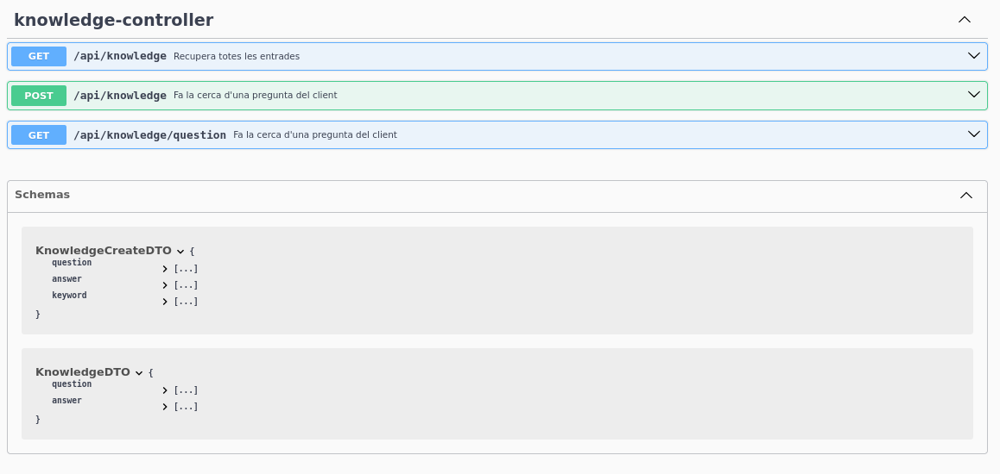
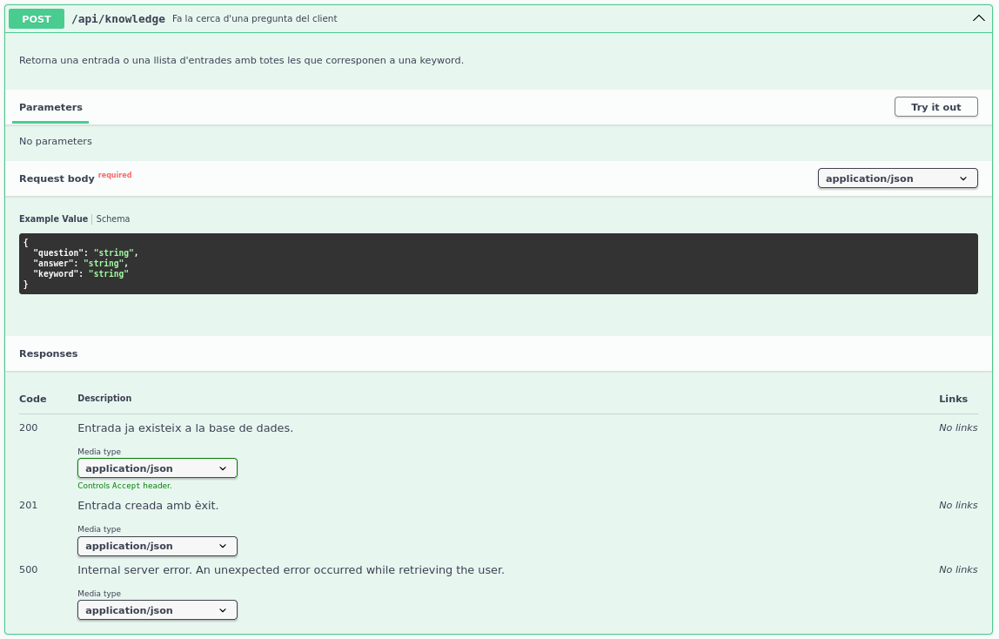
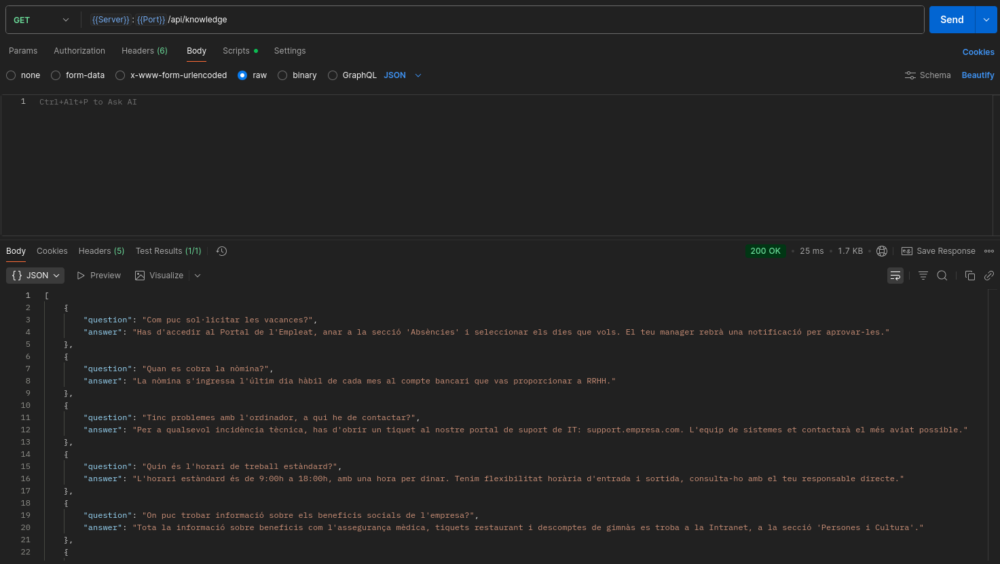
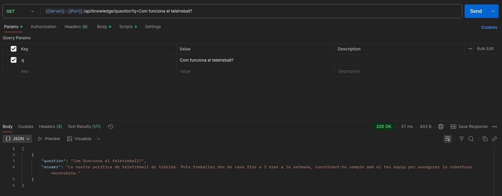
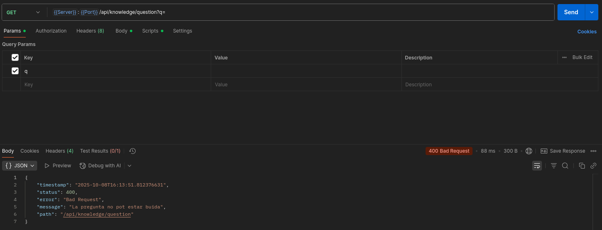
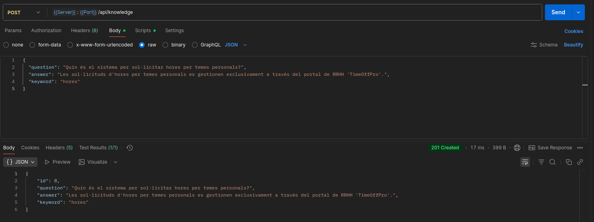
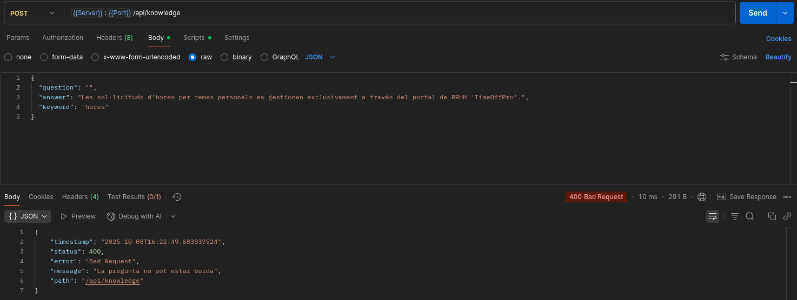

Assistent Conversacional
========================

Descripció
----------

Aquest projecte és un assistent conversacional de consola dissenyat per respondre preguntes freqüents durant el procés d'onboarding de nous empleats. L'aplicació compta amb base de dades H2 en memòria a la qual es creen unes preguntes/respostes cada cop que es llença l'aplicació, una API REST per a la gestió de la base de coneixement i està construïda seguint principis d'arquitectura neta i bones pràctiques de desenvolupament.

Requisits Previs
----------------

Per poder compilar i executar el projecte, necessites tenir instal·lat el següent software:

-   **Java Development Kit (JDK)**: Versió 21 o superior.

-   **Gradle**: El projecte inclou un Gradle Wrapper (`./gradlew`), per la qual cosa no necessites una instal·lació global de Gradle.

-   **Git**: Per clonar el repositori.

-   **(Opcional)** Un IDE de la teva elecció. Ha estat fet amb IntelliJ IDEA Community Edition.

Instal-lació i Execució
-----------------------

1.  **Clonar el repositori:**

    ```
    git clone https://github.com/isaac-diez/onboardingbot
    cd onboardingbot
    ```

2.  **Compilar el projecte amb Gradle:** Aquesta comanda descarregarà les dependències, compilarà el codi i executarà els tests utilitzant el wrapper de Gradle.

    ```
    ./gradlew build
    ```


3.  **Executar l'aplicació:** Un cop compilat, es generarà un fitxer `.jar` a la carpeta `build/libs/`. Executa'l amb la següent comanda:

    ```
    java -jar build/libs/OnboardingBot-0.0.1-SNAPSHOT
    ```

    Un cop executat, l'assistent de consola s'iniciarà automàticament.

Ús del Bot de Consola
---------------------

L'assistent de consola ofereix un menú interactiu per interactuar amb la base de coneixement.

| **Opció** | **Descripció**                                                |
|-----------|---------------------------------------------------------------|
| **1**     | Mostra totes les preguntes i respostes disponibles.           |
| **2**     | Permet a l'usuari escriure una pregunta per obtenir resposta. |
| **3**     | Inicia el procés per afegir una nova entrada.                 |
| **4**     | Tanca l'aplicació.                                            |

#### Exemples de Consultes

Pots provar el bot amb preguntes com les següents:

-   `"Com puc demanar les vacances?"`

-   `"Tinc un problema amb l'ordinador"`

-   `"Informació sobre la nòmina"`

-   `"Necessito material d'oficina"`

El bot normalitzarà el text, identificarà les paraules clau i buscarà coincidències a la base de coneixement.

Proves de l'Aplicació
---------------------

El projecte inclou tests unitaris per a la capa de servei i tests d'integració per a l'API REST. Per executar-los específicament, utilitza la següent comanda de Gradle:

```
./gradlew test

```

Els resultats dels tests i l'informe de cobertura es generaran a la carpeta `build/reports/tests/test`.

Documentació de l'API REST
--------------------------

L'API REST està documentada amb **OpenAPI 3** a través de la llibreria `springdoc-openapi`. Un cop l'aplicació estigui en marxa, pots accedir a la documentació interactiva de **Swagger UI** a través del navegador:

-   **URL de Swagger UI**: [http://localhost:8080/swagger-ui.html](https://www.google.com/search?q=http://localhost:8080/swagger-ui.html "null")

La interfície de Swagger permet veure els detalls de cada endpoint, els models de dades (DTOs) i provar l'API directament:





### Endpoints Disponibles

- `GET /api/knowledge`: Retorna totes les entrades de la base de coneixement.



- `GET /api/knowledge/question`: retorna pregunta i resposta corresponent a una keyword trobada a la pregunta del client i a l'entrada de "pregunta+resposta+paraula clau"


*Passant una pregunta retorna 200 OK tant si la troba com si no.*


*Deixant el paràmetre buit retorna un 400 Bad Request.*

- `POST /api/knowledge`: Afegeix una nova entrada a la base de coneixement passant "pregunta+resposta+paraula clau" (ATENCIÓ: la paraula clau ha de ser 1 única paraula)


*Passant els 3 arguments (pregunta, resposta i paraula clau) retorna un 201 Created.*


*Deixant un dels arguments buits, retorna un 400 Bad Request.*

Autoria
-------
Desenvolupat per: Isaac Díez Peris.